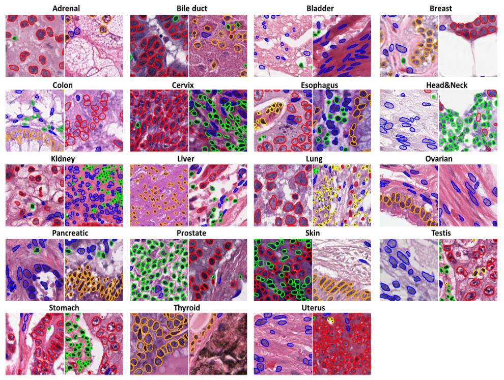
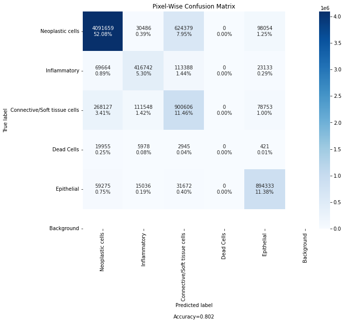
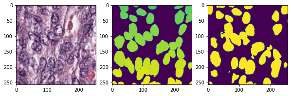
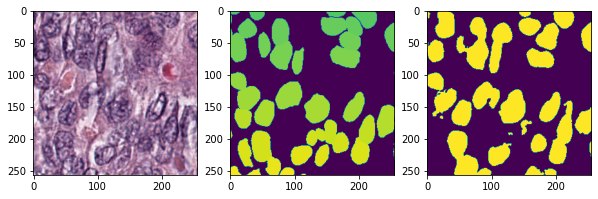
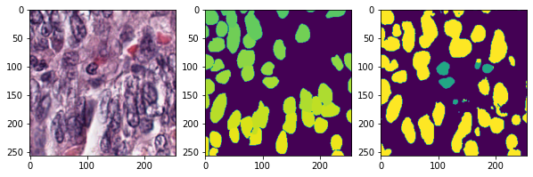
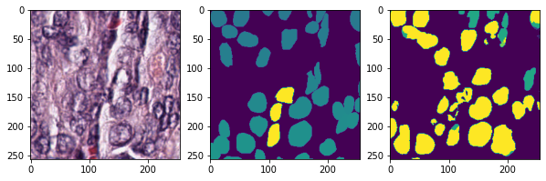
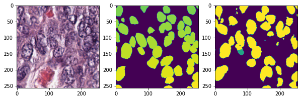
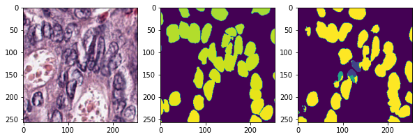
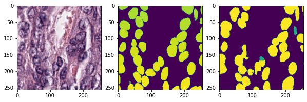

# Cancer Instance Segmentation from Tissue

> ***Repository*** : https://github.com/YAI-Medical/cancer-instance-segmentation-from-tissue

## Credits

**[YAI](https://www.instagram.com/yonsei.ai) 8th 2021 Fall Project - Medical Project Team**

* Team Leader : **[Dongha Kim](https://github.com/kdha0727)** - Yonsei Univ. College of Medicine.

* Team Member : **[Donggeon Bae](https://github.com/AttiBae)** - Yonsei. Univ. Dept. of Electrical and Electronic Engineering.

* Team Member : **[Junho Lee](https://github.com/leejunho0421)** - Yonsei Univ. Dept. of Computer Engineering.

---

## Dataset

> ***Cancer Instance Segmentation and Classification Dataset***

### Data Description

This dataset, also known as PanNuke, contains semi automatically generated nuclei instance segmentation and classification images with exhaustive nuclei labels across 19 different tissue types. The dataset consists of 481 visual fields, of which 312 are randomly sampled from more than 20K whole slide images at different magnifications, from multiple data sources.

In total the dataset contains 205,343 labeled nuclei, each with an instance segmentation mask. Models trained on PanNuke can aid in whole slide image tissue type segmentation, and generalise to new tissues.

19 Tissue types (Breast, Colon, Bile-duct, Esophagus, Uterus, Lung, Cervix, Head&Neck, Skin, Adrenal Gland, Kidney, Stomach, Prostate, Testis, Liver, Thyroid, Pancreas, Ovary, Bladder). Note, that it also unifies existing datasets within it, we have carefully labelled these under a single nuclei categories schema that is common to all 19 tissues.

This particular directory includes training patches of size 256x256 and their masks, this is one of the folds. In total there are more than 7 thousand training patches within all the three folds.

The files within each fold directories are:

* `images.npy` - image patches of 256x256

* `masks.npy` an array of 6 channel instance-wise masks (0: Neoplastic cells, 1: Inflammatory, 2: Connective/Soft tissue cells, 3: Dead Cells, 4: Epithelial, 6: Background)

* `types.npy`  tissue type that a given path was extracted from.

### Data Preview

### Origin: Kaggle

* [**#1**](https://www.kaggle.com/andrewmvd/cancer-inst-segmentation-and-classification): 12.53GiB

* [**#2**](https://www.kaggle.com/andrewmvd/cancer-instance-segmentation-and-classification-2): 11.91GiB

* [**#3**](https://www.kaggle.com/andrewmvd/cancer-instance-segmentation-and-classification-3): 12.84GiB

---

## Model Architecture

**DeepLabV3 + Resnet101**: Baseline

* **Paper**: [Arxiv 1706.05587](https://arxiv.org/abs/1706.05587)

* **Implementation**: [Pytorch Vision](https://pytorch.org/hub/pytorch_vision_deeplabv3_resnet101/)

**U-Net**

* **Paper**: [Arxiv 1505.04597](https://arxiv.org/abs/1505.04597)

* **Implementation**: [models/unet.py](models/unet.py)

**Inception U-Net**

* **Paper**: [ACM 10.1145/3376922](https://dl.acm.org/doi/abs/10.1145/3376922)

* **Implementation**: [models/unet.py](models/unet.py)

**RefineNet**

* **Paper**: [Arxiv 1611.06612](https://arxiv.org/abs/1611.06612)

* **Implementation**: [models/refinenet.py](models/refinenet.py)

## Metrics

- Cost function - Hybrid Loss

  $$
  \text{Loss} = 2\times \text{BCE } + 2 \times \text{Dice } + \text{IoU}
  $$

  1. **Binary Cross Entropy**

  $$
  \text{BCE} = - \sum _{i=1} ^{\text{output size}} y_i \cdot \log {\hat{y}_i}
  $$

  2. **Dice Coefficient**

  $$
  \text{Dice} = \frac{2\times\text{TP}}{(\text{TP} + \text{FP}) + (\text{TP} + \text{FN})}
  $$

  3. **Intersection over Union**

  $$
  \text{IoU} = \frac{\text{Dice}}{2-\text{Dice}}
  $$
  
  
- Optimizing - **Stochastic Gradient Descent with Adam**
    - Learning Rate Scheduling - **[Cosine Annealing Warm Up Restarts](https://github.com/katsura-jp/pytorch-cosine-annealing-with-warmup/)** (See Graph Below)

---

## Results

### Confusion Matrix

### Segmentation Example

---

## Full Source Code

* Github: [kdha0727/cancer-instance-segmentation-from-tissue]()

All non-necessary codes are modularized as package. Watch all codes in github repository.
